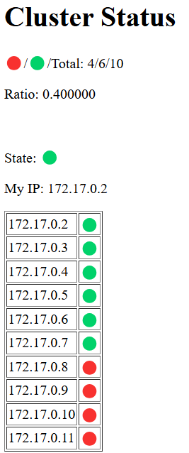

# Node Coloring Algorithm

This project implements a node coloring algorithm for a distributed system. The algorithm ensures that the ratio of nodes in two states is maintained according to a predefined ratio.

All nodes are symmetric, all are running simple http server. However, only first node has set port forwarding in Vagrantfile, so only first node server is accessible from host machine. 

####  Link to the first node:
[http://localhost:8080/](http://localhost:8080/)

## Principle
- Each node can be in one of two states: 'A' (red) or 'B' (green).
- Nodes send periodic heartbeat messages to a multicast group.
- Every node listens for heartbeat messages from all other nodes.
- Every nodes manages its list of known nodes and their states.
- If actual ratio of nodes is off and node can make it better by transitioning state -> 
- Check if node has lowest IP address in the group
- If yes, transition to the other state

## Configuration
- Heartbeat messages are sent every 1 second.
- If node does not hear from another node for 3 seconds, it is considered dead and erased from the list of known nodes. (Can be changed in the code)
- Http server is running on port 8080 and shows the state of the whole cluster.

## Implementation
Written in C++, CMake. Compiled in separate `gcc:latest` container and finally copied into the main container `ghcr.io/maxotta/kiv-dsa-vagrant-base-docker:latest`.

## Running the application
1. Run `vagrant up` in the root directory of the project.
2. Navigate to the first node [http://localhost:8080/](http://localhost:8080/) to see the state of the cluster (might be also available as hyperlink in Docker Desktop).
3. See logs of every container in Docker Desktop or `docker logs node-<number>`.
4. Try to stop and start some containers to see how system behaves.

# Discussion
- The algorithm is simple and works well for small number of nodes.
- Alg. does not scale for larger amount of nodes, which would lead to huge traffic (that could be somewhat mitigated by increasing heartbeat interval and timeout).
- Code does not scale for more than two states.

#### Example of server output:
